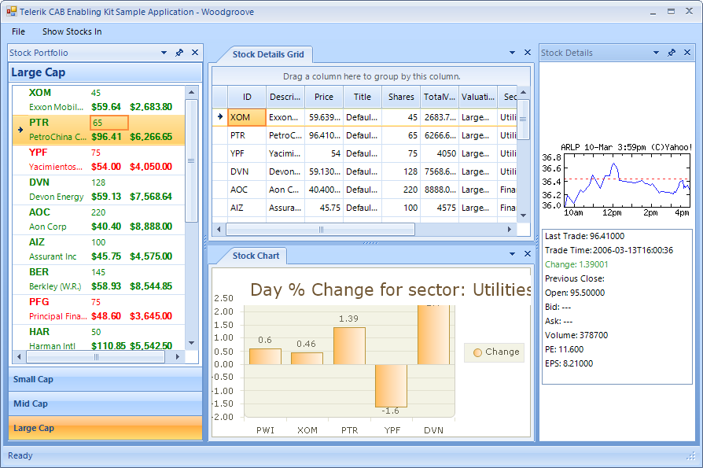

# Telerik CAB Enabling Kit for RadControls for WinForms

The Telerik CAB Enabling Kit for WinForms provides seamless integration of Telerik UI for WinForms (http://www.telerik.com/products/winforms.aspx) with the Composite UI Application Block (CAB). It is well suited for enterprise applications, and helps developers with using the best practices and patterns.

## Project Description

The Telerik CAB Enabling Kit (TCEK) for WinForms can be used to develop smart-client line-of-business applications such as OLTP (online transaction processing) front ends for data entry applications; rich client portals to back-end services like government or bank teller applications; UI-intensive stand-alone applications such as those used by call center staff, IT support desks or stock traders. 

## Telerik CAB Enabling Kit for WinForms in a Nutshell

The Telerik CAB Enabling Kit includes a set of Workspaces, UIElementAdapters, CommandAdapters, and CAB Application Classes for selected Telerik WinForms controls to help developers use common practices and patterns when building visually appealing and productive enterprise applications.

>caption Figure 1: CAB Application

## With the Telerik CAB Enabling Kit you can

* Easily develop smart client applications with renowned packages like Telerik UI for WinForms, the Composite UI Application Block framework, and Visual Studio 2010+

* Add enterprise-grade components with rich visual styling to your existing CAB applications by using Telerik UI for WinForms

* Build complex, enterprise-ready Windows Forms solutions, based on common patterns and practices found in line-of-business front-end applications

## What’s in the package

The CAB kit contains all needed wrappers to start using Telerik UI for WinForms with the CAB framework right away. It also comes with documentation and a reference application to decrease the learning curve and to help you quickly get you up to speed.

**Supported Telerik WinForms components**"

* [RadTreeView](https://www.telerik.com/products/winforms/treeview.aspx)
* [RadDock](https://www.telerik.com/products/winforms/dock.aspx)
* [RadMenu](https://www.telerik.com/products/winforms/menus.aspx#radmenu)
* [RadPageView](https://www.telerik.com/products/winforms/pageview.aspx)
* [RadForm](https://www.telerik.com/products/winforms/form.aspx)
* [RadCommandBar](https://www.telerik.com/products/winforms/commandbar.aspx)
* [RadRibbonBar](https://www.telerik.com/products/winforms/ribbonbar.aspx)
* [RadStatusStrip](https://www.telerik.com/products/winforms/statusstrip.aspx)

**Workspaces**:

* RadDockWorkspace
* RadPageViewPageWorkspace
* RadFormMdiWorkspace
* RadTabbedMdiWorkspace

**UIElementAdapters**:

*  RadCommandBarUIAdapter
*  RadItemCollectionUIAdapter
*  RadMenuUIAdapter
*  RadMenuItemsCollectionUIAdapter
*  RadRibbonBarUIAdapter
*  RadTreeViewUIAdapter
*  RadTreeNodeUIAdapter

**CAB Application Classes**:

* RadWindowsFormsApplication
* RadFormShellApplication
* RadApplicationContextApplication

**Documentation**: [https://docs.telerik.com/devtools/winforms/telerik-cab-enabling-kit/telerik-cab-enabling-kit](https://docs.telerik.com/devtools/winforms/telerik-cab-enabling-kit/telerik-cab-enabling-kit)

**Sample application with RadControls for WinForms and CAB**
The Telerik CAB Enabling Kit for WinForms solution comes with two sample applications - Finance and BankTeller. The finance application is modeled after the famous WPF WoodGrove Finance Application. It uses the CAB framework and all supported Telerik controls.

## Requirements

* Visual Studio 2010+
* .NET Framework 2.0+ 
* Composite UI Application Block Framework

## Installation Instructions

1. Download the Telerik RadControls for WinForms from Telerik's website: http://www.telerik.com/account.aspx. 
2. Install Telerik RadControls for WinForms, this will add the Telerik assemblies to your machine's Global Assembly Cache (GAC).
3. Download the Telerik CAB Enabling Kit.
4. Unzip the Telerik CAB Enabling Kit.
5. Open the ~\FinanceApplicationCAB\FinanceApplicationCAB.sln solution file from the location where you have unzipped the Telerik CAB Enabling Kit.
6. Check that the Shell project is set as the start up project for the solution.
7. Run the example project.
8. The Telerik CAB Extensions solution can be found at  ~\Source\Telerik.CAB.WinForms\Telerik.CAB.WinForms.sln.

## See Also

* [Telerik WinForms Product Page](https://www.telerik.com/products/winforms.aspx)
* [The Telerik CAB Enabling Kit Forum](https://www.telerik.com/forums/winforms/cab-enabling-kit)
* [Microsoft Composite UI Application Block Framework](http://smartclient.codeplex.com/)
* [Rich Newman’s Introduction to CAB/SCSF](https://richnewman.wordpress.com/about/code-listings-and-diagrams/intro-to-cab-toc/)
* [Composite UI Application Block in C#](https://www.microsoft.com/en-us/download/details.aspx?id=22131)